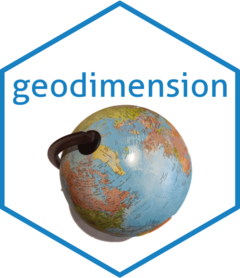

<!-- README.md is generated from README.Rmd. Please edit that file -->

```{r, include = FALSE}
knitr::opts_chunk$set(
  collapse = TRUE,
  comment = "#>",
  fig.path = "man/figures/README-",
  out.width = "100%"
)
```

# geodimension <a href="https://josesamos.github.io/geodimension/"></a>

<!-- badges: start -->
[](https://CRAN.R-project.org/package=geodimension)
[](https://github.com/josesamos/geodimension/actions/workflows/R-CMD-check.yaml)
[](https://app.codecov.io/gh/josesamos/geodimension?branch=master)
[](https://www.r-pkg.org:443/pkg/geodimension)
<!-- badges: end -->

The *geographic dimension* plays a fundamental role in multidimensional systems. To define a geographic dimension in a star schema, we need a table with attributes corresponding to the levels of the dimension. Additionally, we will also need one or more geographic layers to represent the data using this dimension. 

We can obtain this data from available vector layers of geographic information. In simple cases, one layer is enough; but we often need several layers related to each other. The relationships can be defined by common attribute values or can be inferred from the respective geographic information.

The goal of `geodimension` is to support the definition of geographic dimensions from layers of geographic information that can be used in multidimensional systems. In particular, through package [`geomultistar`](https://cran.r-project.org/package=geomultistar) they can be used directly.

## Installation

You can install the released version of `geodimension` from [CRAN](https://CRAN.R-project.org) with:

``` r
install.packages("geodimension")
```

And the development version from [GitHub](https://github.com/) with:

``` r
# install.packages("devtools")
devtools::install_github("josesamos/geodimension")
```
## Example

This is a basic example which shows you how to generate a `geodimension` from several vector layers of geographic information. It also shows how to use it.

Suppose that, for the US, we want to define a geographic dimension at the *state* level but also include the information at the predefined higher organization levels: *region*, *division* and also *nation*. We have obtained geographic layers for each of these levels: `layer_us_state`, `layer_us_region`, `layer_us_division` and `layer_us_nation`. From each layer, we define a `geolevel`.

```{r message=FALSE, warning=FALSE}
library(geodimension)

state <-
  geolevel(name = "state",
           layer = layer_us_state,
           key = c("geoid")) |>
  complete_point_geometry()

region <-
  geolevel(name = "region",
           layer = layer_us_region,
           key = c("geoid"))

division <-
  geolevel(name = "division",
           layer = layer_us_division,
           key = c("geoid"))

nation <-
  geolevel(name = "nation",
           layer = layer_us_nation,
           key = c("geoid"))
```

We define a `geodimension` that includes all the levels in which we are interested.

```{r}
gd <-
  geodimension(name = "gd_us",
               level = region) |>
  add_level(division) |>
  add_level(state) |>
  add_level(nation)
```

Next, we define the relationships that exist between the levels: some based on common attributes, others on geographic relationships between their instances.

```{r message=FALSE, warning=FALSE}
gd <- gd |>
  relate_levels(lower_level_name = "state",
                lower_level_attributes = c("division"),
                upper_level_name = "division") |>
  relate_levels(lower_level_name = "division",
                upper_level_name = "region",
                by_geography = TRUE) |>
  relate_levels(lower_level_name = "region",
                upper_level_name = "nation",
                by_geography = TRUE)
```

There are no restrictions on the relationships you define, as long as the relationship can be established.

With these operations we have defined a `geodimension`. From it we can obtain the data table to define a dimension in a star schema or the layer or layers associated with that table at the level we need.

```{r}
ld <- gd |>
  get_level_data(level_name = "division")
names(ld)

ld <- gd |>
  get_level_data(level_name = "division",
                 inherited = TRUE)
names(ld)

ll <- gd |>
  get_level_layer(level_name = "division",
                 inherited = TRUE)
names(ll)
```

If we need the data at another level of detail, we can obtain it in a similar way.

```{r}
ld <- gd |>
  get_level_data(level_name = "state",
                 inherited = TRUE)
names(ld)

ll <- gd |>
  get_level_layer(level_name = "state",
                  only_key = TRUE)

plot(ll)
```

In addition to these functions, the package offers other support functions to aid in the definition of levels (for example, to determine the key attributes of a layer), to relate instances of levels whose relationship is not immediately established, or to configure the `geodimension` to obtain a customized output.
