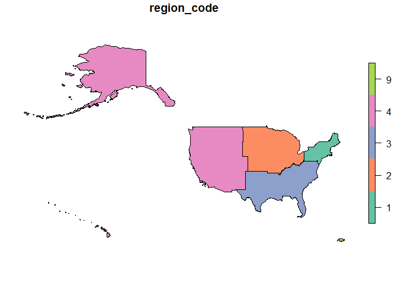

<!-- README.md is generated from README.Rmd. Please edit that file -->

# geodimension <a href="https://josesamos.github.io/geodimension/"></a>

<!-- badges: start -->

[](https://CRAN.R-project.org/package=geodimension)
[](https://github.com/josesamos/geodimension/actions/workflows/R-CMD-check.yaml)
[](https://app.codecov.io/gh/josesamos/geodimension?branch=master)
[](https://www.r-pkg.org:443/pkg/geodimension)
[](https://www.r-pkg.org:443/pkg/geodimension)
<!-- badges: end -->

The *geographic dimension* plays a fundamental role in multidimensional
systems. To define a geographic dimension in a multidimensional star
schema, we need a table with attributes corresponding to the levels of
the dimension. Additionally, we will also need one or more geographic
layers to represent the data using this dimension.

We can obtain this data from available vector layers of geographic
information. In simple cases, one layer is enough. We often need several
layers related to each other. The relationships can be defined by common
attribute values or can be inferred from the respective geographic
information.

The goal of `geodimension` is to support the definition of geographic
dimensions from layers of geographic information that can be used in
multidimensional systems. In particular, through packages
[`rolap`](https://cran.r-project.org/package=rolap) and
[`geomultistar`](https://cran.r-project.org/package=geomultistar).

## Installation

You can install the released version of `geodimension` from
[CRAN](https://CRAN.R-project.org) with:

``` r
install.packages("geodimension")
```

And the development version from [GitHub](https://github.com/) with:

``` r
# install.packages("devtools")
devtools::install_github("josesamos/geodimension")
```

## Example

This is a basic example which shows you how to generate a `geodimension`
from tables and vector layers of geographic information. It also shows
how to use it.

Suppose that, for the US, we want to define a geographic dimension at
the *state* level but also include the information at the predefined
higher organization levels: *division*, *region* and *country*,
available in the package in the `us_division` variable, shown below.

| division_code |   division_name    | region_code | region_name | country |
|:-------------:|:------------------:|:-----------:|:-----------:|:-------:|
|       1       |    New England     |      1      |  Northeast  |   USA   |
|       2       |  Middle Atlantic   |      1      |  Northeast  |   USA   |
|       3       | East North Central |      2      |   Midwest   |   USA   |
|       4       | West North Central |      2      |   Midwest   |   USA   |
|       5       |   South Atlantic   |      3      |    South    |   USA   |
|       6       | East South Central |      3      |    South    |   USA   |
|       7       | West South Central |      3      |    South    |   USA   |
|       8       |      Mountain      |      4      |    West     |   USA   |
|       9       |      Pacific       |      4      |    West     |   USA   |
|       0       |    Puerto Rico     |      9      | Puerto Rico |   USA   |

In [United States Census Bureau](https://www.census.gov) we find layers
at various levels of detail, including *state*. Weget a geographic layer
for *state* level (`layer_us_state`).

``` r
library(geodimension)

file <- system.file("extdata", "us_layers.gpkg", package = "geodimension")
layer_us_state <- sf::st_read(file, layer = "state", quiet = TRUE)

plot(sf::st_shift_longitude(sf::st_geometry(layer_us_state)))
```


From it we can define all the levels. From each layer, we define a
`geolevel`.

``` r
state <-
  geolevel(name = "state",
           layer = layer_us_state,
           key = "GEOID")

division <-
  geolevel(
    name = "division",
    layer = us_division,
    attributes = c("country", "region_code", "division_name"),
    key = "division_code"
  ) |>
  add_geometry(layer = layer_us_state,
               layer_key = "DIVISION")

region <-
  geolevel(
    name = "region",
    layer = us_division,
    attributes = c("country", "region_name"),
    key = "region_code"
  ) |>
  add_geometry(layer = layer_us_state,
               layer_key = "REGION")

country <-
  geolevel(
    name = "country",
    layer = get_level_layer(region),
    attributes = "country",
    key = "country"
  )
```

We define a `geodimension` that includes all the levels in which we are
interested.

``` r
gd <-
  geodimension(name = "gd_us",
               level = state,
               snake_case = TRUE) |>
  add_level(level = division) |>
  add_level(level = region) |>
  add_level(level = country)
```

Next, we define the relationships that exist between the levels: some
based on common attributes, others on geographic relationships between
their instances.

``` r
gd <- gd |>
  relate_levels(
    lower_level_name = "state",
    lower_level_attributes = "DIVISION",
    upper_level_name = "division"
  ) |>
  relate_levels(
    lower_level_name = "division",
    upper_level_name = "region",
    by_geography = TRUE
  ) |>
  relate_levels(
    lower_level_name = "region",
    lower_level_attributes = "country",
    upper_level_name = "country"
  )
```

There are no restrictions on the relationships we define, as long as the
relationship can be established.

With these operations we have defined a `geodimension`. From it we can
obtain a data table to define a dimension in a star schema or the layer
or layers associated with that table at the level we need. We can also
get a table with latitude and longitude defined as fields.

``` r
ld <- gd |>
  get_level_data(level_name = "division")
names(ld)
#> [1] "division_code"  "country"        "region_code"    "division_name" 
#> [5] "fk_region_code"

ld <- gd |>
  get_level_data(level_name = "division",
                 inherited = TRUE)
names(ld)
#> [1] "division_code"           "division_country"       
#> [3] "division_region_code"    "division_name"          
#> [5] "division_fk_region_code" "region_country"         
#> [7] "region_name"

ll <- gd |>
  get_level_layer(level_name = "division",
                 inherited = TRUE)
names(ll)
#> [1] "division_code"           "division_country"       
#> [3] "division_region_code"    "division_name"          
#> [5] "division_fk_region_code" "region_country"         
#> [7] "region_name"             "geom"

lg <- gd |>
  get_level_data_geo(level_name = "division",
                     inherited = TRUE)
names(lg)
#> [1] "division_code"           "division_country"       
#> [3] "division_region_code"    "division_name"          
#> [5] "division_fk_region_code" "region_country"         
#> [7] "region_name"             "intptlon"               
#> [9] "intptlat"
```

If we need the data at another level of detail, we can obtain it in a
similar way.

``` r
ld <- gd |>
  get_level_data(level_name = "region",
                 inherited = TRUE)
names(ld)
#> [1] "region_code"    "region_country" "region_name"

ll <- gd |>
  get_level_layer(level_name = "region",
                  only_key = TRUE)

plot(sf::st_shift_longitude(ll))
```



In addition to these functions, the package offers other support
functions to aid in the definition of levels (for example, to determine
the key attributes of a layer), to relate instances of levels whose
relationship is not immediately established, or to configure the
`geodimension` to obtain a customized output.

For example, we can obtain a table with level data and geographic data
represented in the form of points, with longitude and latitude, to be
included in other tools that use this format.

``` r
ld_geo <- gd |>
  get_level_data_geo(level_name = "region")

pander::pandoc.table(ld_geo, split.table = Inf)
```

| region_code | country | region_name | intptlon | intptlat |
|:-----------:|:-------:|:-----------:|:--------:|:--------:|
|      1      |   USA   |  Northeast  |  -74.79  |  43.27   |
|      2      |   USA   |   Midwest   |  -93.19  |  43.21   |
|      3      |   USA   |    South    |  -91.29  |   32.9   |
|      4      |   USA   |    West     |  -113.2  |  40.77   |
|      9      |   USA   | Puerto Rico |  -66.28  |  18.21   |
